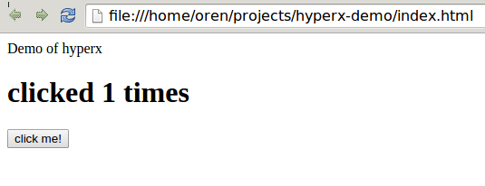

# hyperx-demo

Substack's simplified version of React - virtual-dom and main-loop instead of React, and hyperx instead of JSX.



Run

```
sudo npm install browserify -g
npm install
browserify index.js -o bundle.js
```
open index.html in the browser

The code

```js
var vdom = require('virtual-dom')
var hyperx = require('hyperx')
var hx = hyperx(vdom.h)
var main = require('main-loop')
var loop = main({ times: 0 }, render, vdom)

document.querySelector('#content').appendChild(loop.target)

function render (state) {
  return hx`<div>
    <h1>clicked ${state.times} times</h1>
    <button onclick=${onclick}>click me!</button>
  </div>`

  function onclick () {
    loop.update({ times: state.times + 1 })
  }
}
```
